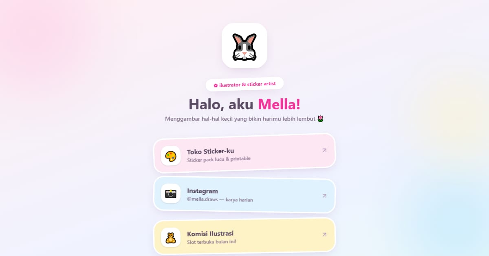

# Mella — Ilustrator & Sticker Artist

Tautan Mella, ilustrator dan sticker artist di Malang: toko lima pack sticker vinyl, jadwal bazar, komisi ilustrasi dengan estimasi harga, dan kerja sama brand.

**Demo live:** https://linkinbio-mellow.vercel.app



> Template link-in-bio dengan persona fiktif. Akun, klien, harga, dan jadwal hanya contoh; tautan utama menuju halaman dalam yang benar-benar ada, dan formulir tidak mengirim data.

## Konsep

Persona Mella, ilustrator dan pembuat stiker. Papan stiker pastel: tautan berbentuk stiker miring bertepi putih, avatar kelinci, dan hover yang memantul.

## Halaman

- `/` — stiker-stiker tautan miring berbingkai putih, avatar kelinci yang mengambang, awan pastel
- `/toko` — lima pack sticker dengan keranjang (ongkir & gratis ongkir dihitung) dan jadwal bazar
- `/komisi` — slot per bulan, formulir komisi dengan estimasi harga langsung, kerja sama brand

## Teknologi

- Next.js 15.5 (App Router) dan React 19
- Tailwind CSS v4
- JavaScript
- Lucide (ikon)
- Font: Quicksand (next/font)
- SEO: metadata per halaman, Open Graph, JSON-LD, sitemap.xml, dan robots.txt

## Menjalankan secara lokal

```bash
npm install
npm run dev
```

Buka http://localhost:3000. Untuk build produksi: `npm run build` lalu `npm start`.

---

Bagian dari koleksi 12 template link-in-bio di [PortalBio](https://portal-bio-neon.vercel.app). Dibuat oleh [PintuWeb](https://pintuweb.com), jasa pembuatan website.
